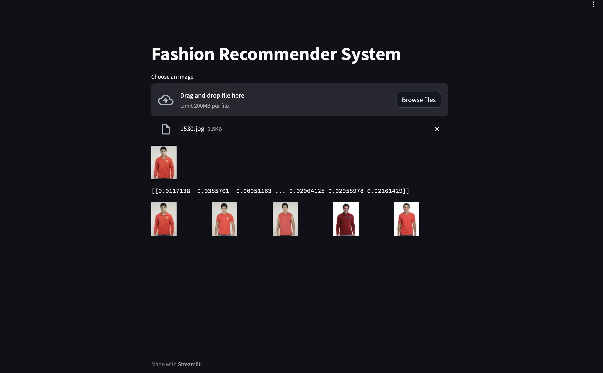

# Fashion_Recommender_Project
Resnet50 | CNN | KNN 

## Proje Hakkında

Bu proje, en son giyim trendlerine göre kullanıcılara öneriler sunan bir moda tavsiye sistemi içerir.

**Not:** Bu örnekleme için daha küçük bir veri seti kullanılmıştır. Daha fazla veri için [Kaggle'daki orijinal veri setine](https://www.kaggle.com/datasets/paramaggarwal/fashion-product-images-dataset) göz atabilirsiniz.

## ResNet-50 Modeli

Projemiz, ResNet-50 adlı önceden eğitilmiş bir derin öğrenme modelini kullanır. Bu model, giyim ürünlerinin özelliklerini çıkarmak için kullanılır.

### ResNet-50 Hakkında

- ResNet-50, 50 katmanlı bir derin evrişimli sinir ağı modelidir.
- Büyük bir veri kümesi üzerinde eğitilmiştir ve nesne tanıma görevlerinde başarılı sonuçlar verir.
- Projemizde bu model, giyim ürünlerinin özelliklerini çıkarmak için kullanılır.

## Özellik Çıkarma İşlemi

Giyim ürünlerinin özelliklerini çıkarmak için ResNet-50 modelini kullanırız. İşlem şu şekildedir:

1. Kullanıcı tarafından yüklenen giyim ürününün fotoğrafını alırız.
2. Görüntüyü modelin anlayabileceği bir formata dönüştürürüz (224x224 piksel).
3. Model, bu görüntü üzerinde özellik çıkarma işlemi yapar ve bir özellik vektörü oluşturur.
4. Elde edilen özellik vektörünü normalize ederek işlemi tamamlarız.

## K-En Yakın Komşu (KNN) Algoritması

Önerileri sunmak için K-En Yakın Komşu (KNN) algoritmasını kullanırız. KNN, benzer öğeleri bulmak için komşuluk bilgisini kullanır. İşleyiş şu şekildedir:

1. Eğitim aşamasında, her giyim ürününün özellikleri ve etiketleri saklanır.
2. Tahmin aşamasında, yeni bir ürün için en yakın K komşusunu bulmak için benzerlik hesaplamaları yapılır.
3. En yakın komşuların etiketleri, kullanıcıya öneriler sunmak için kullanılır.

KNN algoritması, basit ve etkili bir öneri sistemi sağlar. Bu projede, giyim ürünlerinin özelliklerini KNN kullanarak analiz ederiz.

## Nasıl Kullanılır?

1. Ana sayfaya gidin.
2. "Choose an Image" düğmesine tıklayarak kendi giyim ürününüzün fotoğrafını yükleyin.
3. Fotoğraf, model tarafından işlenir ve özellikleri çıkartılır.
4. Çıkartılan özellikler kullanılarak benzer ürünler bulunur.
5. En benzer ürünler, ekranın alt kısmında gösterilir.

## Gereksinimler

Bu projeyi çalıştırmak için şu kütüphanelere ihtiyacınız vardır:

- streamlit
- PIL (Python Imaging Library)
- pandas
- numpy
- tensorflow
- scikit-learn
- OpenCV

## İletişim

Proje geliştirmeye ve öneriye açıktır. 

